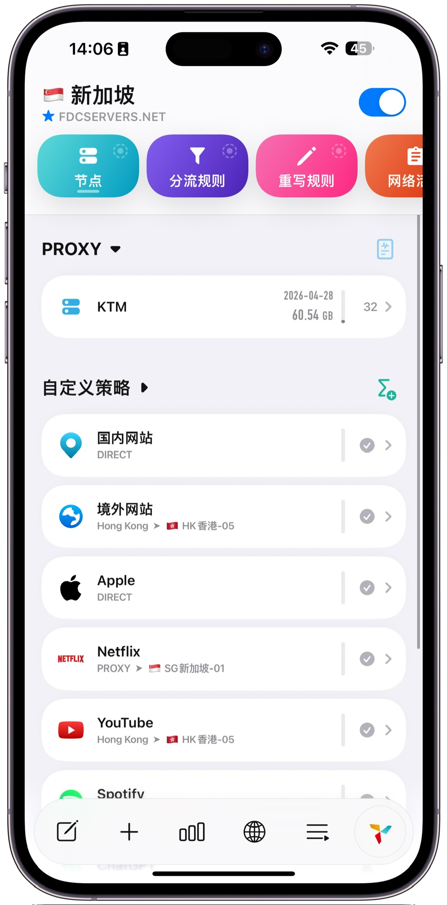

# Quantumult X 个人配置库

本仓库为 Quantumult X 提供优化配置、分流规则及实用脚本，支持开箱即用与灵活自定义，助力提升网络体验。

## 📋 项目结构

- **profile/**：核心配置文件
  - `QX_Config.conf`：完整配置模板，涵盖通用设置、DNS、策略组等
- **scripts/**：实用脚本集合
  - 包含广告拦截、功能增强等辅助脚本
- **rewrite/**：重写规则目录
  - 各类应用的重写规则文件
- **rules/**：分流规则目录
  - 各类分流规则文件

## 👀 配置预览

以下为 Quantumult X 配置界面预览：

  
  
  

---

## 🚀 快速开始

### 1. 导入配置文件

**方式一：URL 导入（推荐）**
1. 打开 Quantumult X，点击右下角图标
2. 选择「下载配置」
3. 粘贴配置文件 Raw 链接或本地路径：[长按复制连接](https://raw.githubusercontent.com/curtinp118/QuantumultX/refs/heads/main/profile/QX_Config.conf)
4. 点击「下载」并保存

**方式二：手动导入**
1. 复制 [profile/QX_Config.conf](profile/QX_Config.conf) 的完整内容
2. 在 Quantumult X 中点击右下角图标
3. 选择「编辑」
4. 粘贴内容并保存

## ⚠️ 重要声明

- 部分脚本用于修改应用响应数据，仅供个人学习和测试
- 使用这些脚本可能违反相关应用服务条款，风险自担
- 不建议在生产环境或关键账户使用
- 作者不对使用本仓库资源产生的任何后果负责

## 🤝 使用建议

- 定期检查配置文件和脚本更新
- 根据实际网络环境调整 DNS 服务器和节点选择
- 谨慎启用修改响应脚本，注意账户安全
- 更新前请备份现有配置

## 🙏 鸣谢与引用

本项目部分规则及脚本引用自以下优秀作者及社区：

- **分流规则作者**：blackmatrix7
- **资源解析与脚本**：KOP-XIAO
- **广告拦截规则**：墨鱼去广告（chxm1023）、ddgksf2013
- **图标与其他资源**：Koolson、fmz200、xream 

感谢以上作者及社区的无私分享与贡献！

## 📄 许可证

本项目采用 [GNU General Public License v3.0](LICENSE) 许可证，详见 [LICENSE](LICENSE) 文件。

---

> **最后更新：2026年1月12日**
